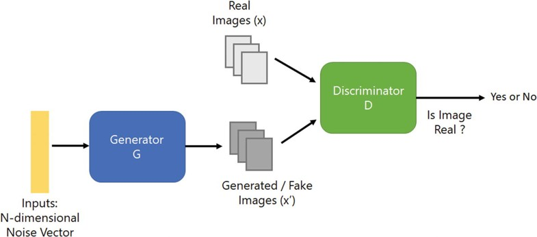

<!-- PROJECT LOGO -->
<br />

<p align="center">
  
  <h3 align="center">Generative Adversarial Networks (GAN)</h3>
  <p align="center">
    Deep convolutional GAN and Self Attention GAN using CIFAR-10 dataset
  </p>
</p>

> tags : generative adversarial networks, gan, dcgan, sagan, cifar-10, deep learning, tensorflow

<!-- TABLE OF CONTENTS -->
## Table of Contents

* [About the Project](#about-the-project)
  * [Built With](#built-with)
* [Getting Started](#getting-started)
  * [Prerequisites](#prerequisites)
  * [Instructions to run](#instructions-to-run)
* [Models overview](#models-overview)
  * [Deep Convolutional GAN](#deep-convolutional-gan)
  * [Self Attention GAN](#self-attention-gan)
* [Results](#results)

---

## About The Project

This project is about learning a generative model from which new samples can be generated. The dataset used for this project is CIFAR-10. The CIFAR-10 dataset consists of 60000 32x32 colour images in 10 classes, with 6000 images per class. There are 50000 training images and 10000 test images.  

In this project, two types of Generative Adversarial Networks (GANs) are implemented:  

* Deep Convolution GAN (DCGAN)  
* Self-Attention GAN (SA-GAN)  

GANs consist of two networks – a generator (G) and a discriminator (D). G produces fake samples from random noise, while D classifies whether a given image is real or fake. Both networks compete in a zero-sum game, improving each other during training.  

---

### Built With
* Python v3.7  
* TensorFlow v2.2  
* Jupyter notebooks  
* Additional libraries listed in [requirements.txt](requirements.txt)  

---

## Getting Started

Clone the repository into a local machine:

```bash
git clone <[your-repo-link](https://github.com/Bilipsha/Image_Generation_using_GAN)>
